# error-detection

*A hardware based digital communication system that demonstrates how data can be encoded, transmitted, and checked for errors using non zero
encoding, parity checking, and Cyclic Redundancy Check (CRC).*

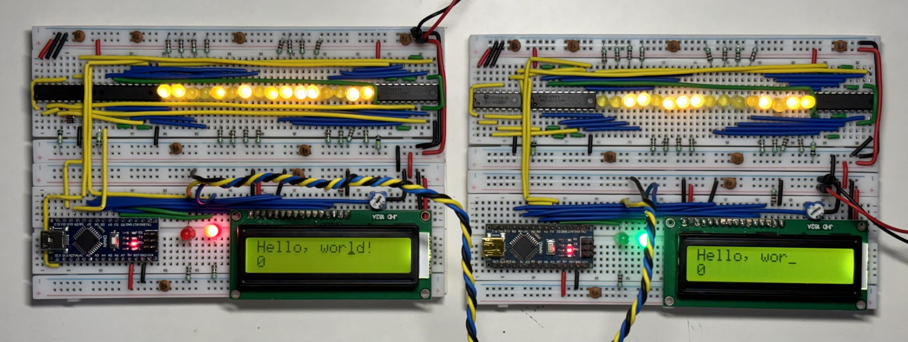

this project was built as a practical exploration of digital communication and error detection using discrete logic and hardware rather than
relying entirely on software. The system takes digital data, processes it through different stages of encoding and error detection, transmits it
through a physical connection, and allows the receiver to verify the integrity of the received data.

## Project Overview

Digital systems constantly move data from one place to another. Whether the data is traveling between two ICs on a circuit board, between computers over a network, or across a communication link, there is always a possibility that some bits may be altered during transmission.

A transmitted: ```10110101```

could potentially arrive as: ```10100101```

Even a single flipped bit can change the meaning of the entire message.

This project demonstrates how a communication system can detect such errors.

The general process is:

```

 DATA --> Non-Zero Encode --> Error Detection Calculation: CRC --> Transmitter --> digital transmission --> Error Checking --> VALID DATA

```

The hardware implementation makes it possible to observe these operations directly rather than treating them as abstract software calculations.

---

## Final Project

A short demonstration of the system transmitting data is shown below.

https://github.com/user-attachments/assets/6dd17cdd-482e-4733-ab90-2e98ce60b680

**The video is intentionally short and focuses on the actual transmission process rather than recording the entire operation.**

---

## How Error Detection Works

The main purpose of this project is to demonstrate that the receiver should not blindly trust the data it receives.

Instead, additional information can be transmitted along with the original data. The receiver can then use that information to determine whether
the data was corrupted.

Two of the main techniques demonstrated in this project are:

* Parity checking
* Cyclic Redundancy Check (CRC)

The project also uses non zero encoding as part of the data transmission process.

### 1. non zero encoding

Before transmitting the data, the signal is encoded so that the transmission does not remain at a constant zero level for long periods.a  long
sequence of zeros can make it difficult to distinguish between an actual data signal and the absence of a signal. Non zero encoding helps ensure
that there are meaningful transitions in the transmitted signal. The basic idea is to transform the original data into a form that is more
suitable for physical transmission.

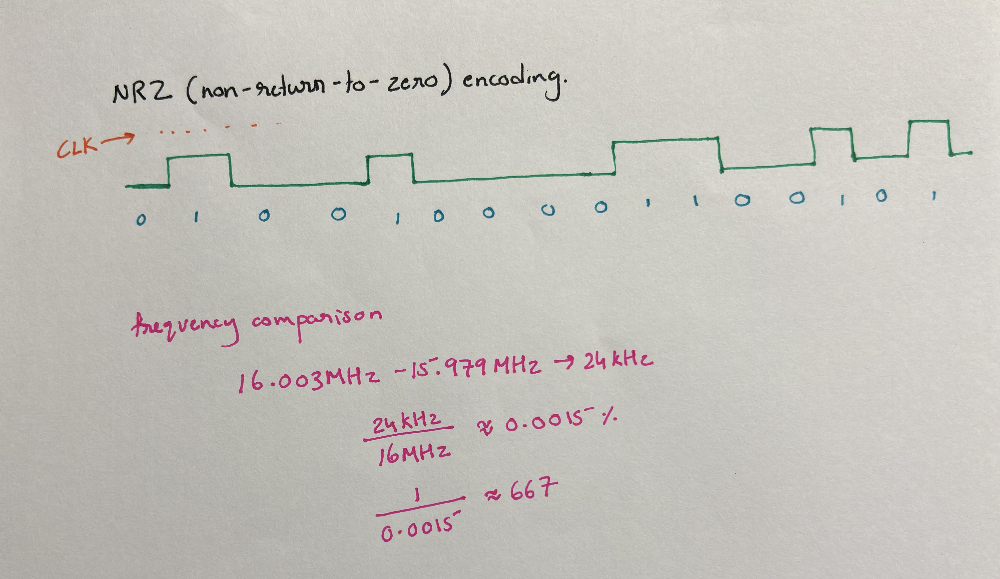

The image above shows the encoding calculations used in the project. This stage is important because error detection is only useful if the
underlying data can be transmitted reliably in the first place.


### 2. Parity Checking

The basic idea is to add an additional bit to a group of data bits. This extra bit is chosen according to the number of 1s present in the
original data.

For example, consider: Data: ```1011001```

The number of 1s can be counted and a parity bit can be generated accordingly.
Depending on the chosen parity scheme, the transmitted data may look like: ```1011001 + parity bit```

When the receiver gets the data, it performs the same calculation. If the expected parity does not match the received parity, the receiver knows
that the data has been corrupted.

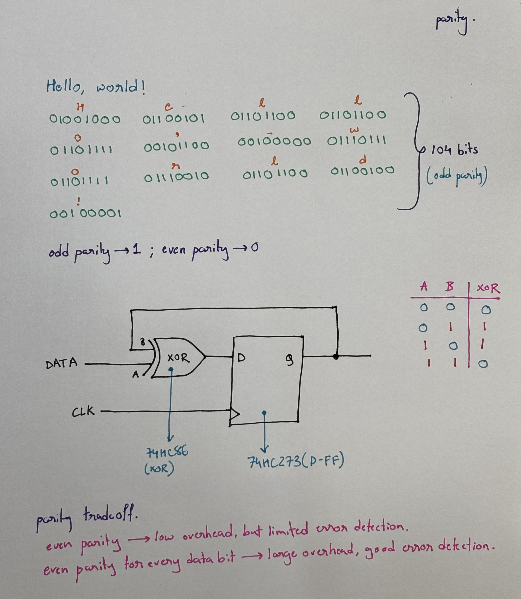

The calculation above shows how the parity value is generated from the transmitted data.


### 3. Cyclic Redundancy Check

CRC is a much more powerful error detection technique than a simple parity bit. Instead of simply counting the number of 1s, CRC treats the data
as a binary polynomial and performs polynomial division using a predefined generator polynomial. The remainder of this division becomes the CRC
value.

The general process is: 
```
Original Data --> Append zeros --> Polynomial Division --> CRC Remainder --> Transmit Data + CRC
```
At the receiver, the same generator polynomial is used to check the received message. If the resulting remainder is not what is expected, the
receiver knows that an error occurred during transmission.

---

## CRC Calculation

### 1. Detecting errors with Modulo Division.
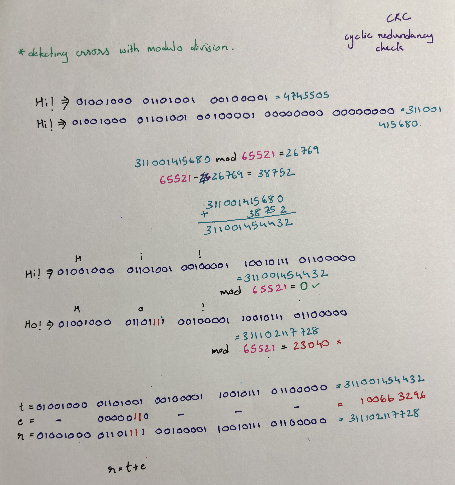

### 2. Message Data as a Polynomial
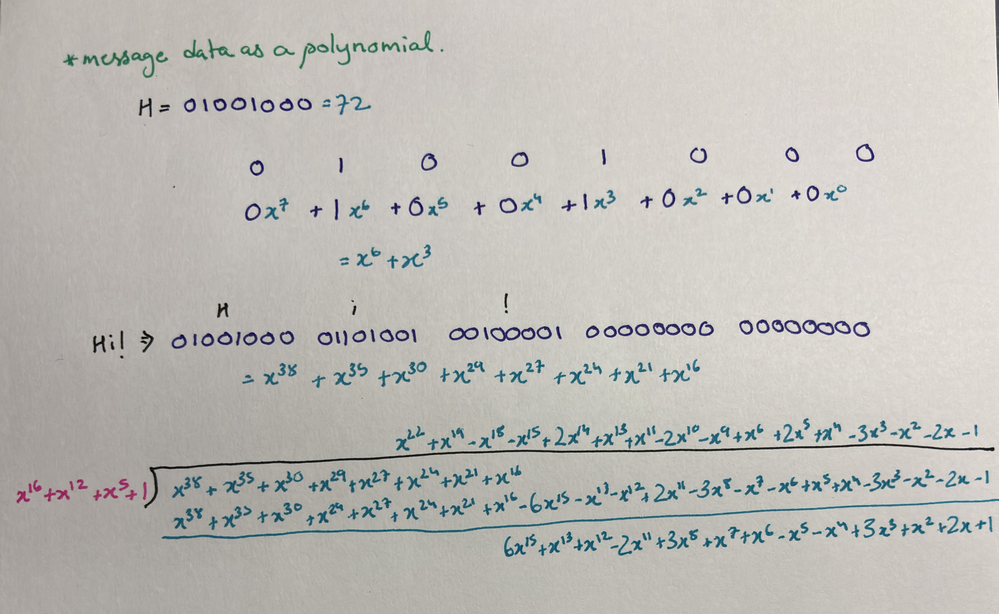

### 3. Finite fields
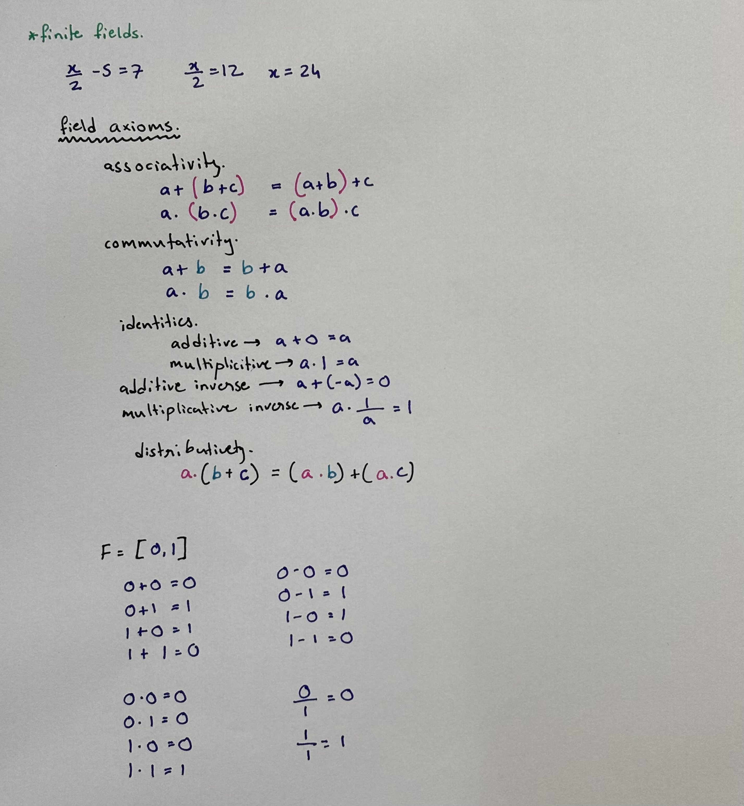

### 4. Polynomial Division
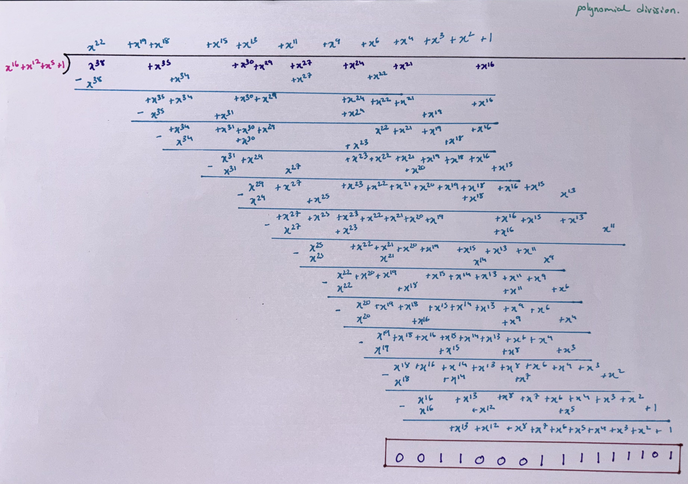

### 5. Sending & Verifying CRC
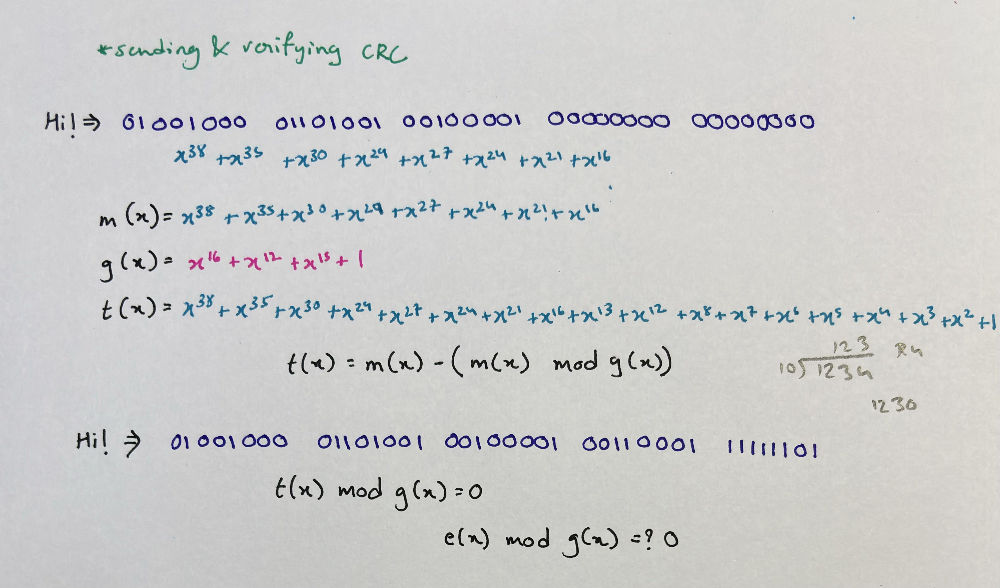

### 6. Choosing a Generator Polynomial
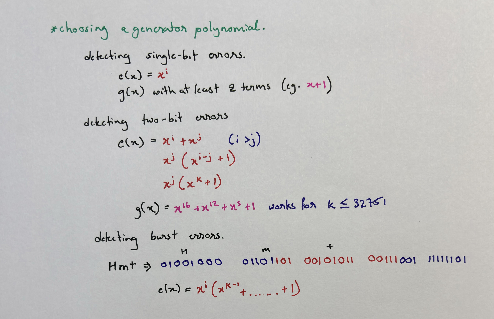

### 7. Hardware Calculation
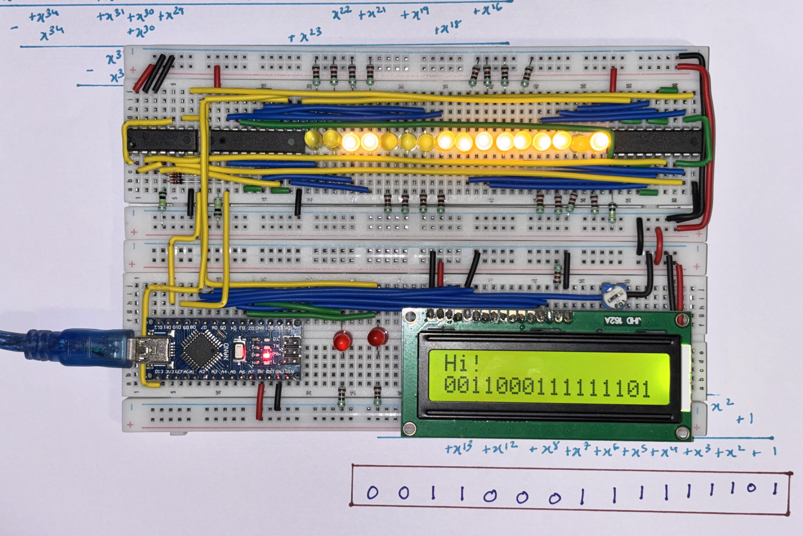

---

## Transmitter & Receiver

### Transmitter

The transmitter is responsible for preparing the data before it is sent to the receiver.

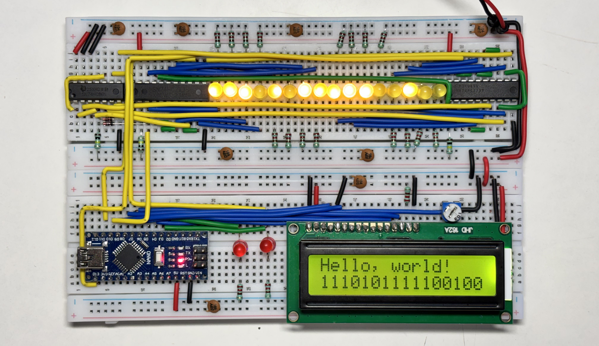

The general flow is:
```
Input Data --> Encoding --> Error Detection Information --> Transmission Logic --> Output Signal
```

### Receiver

The receiver takes the transmitted signal and reconstructs the digital data. After receiving the data, it can perform the required checks to
determine whether the transmission was successful.

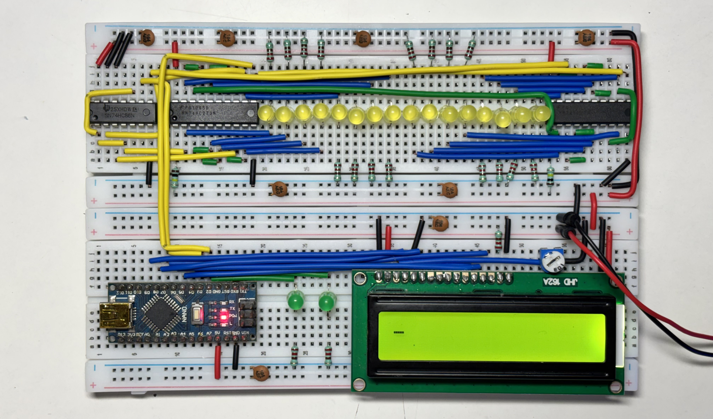

The general process is:
```
Received Signal --> Data Recovery --> Error Detection
                                        │
                                        ├─ Valid --> Data Accepted
                                        │
                                        └── Error --> Data Rejected

```

---

## Circuit Design

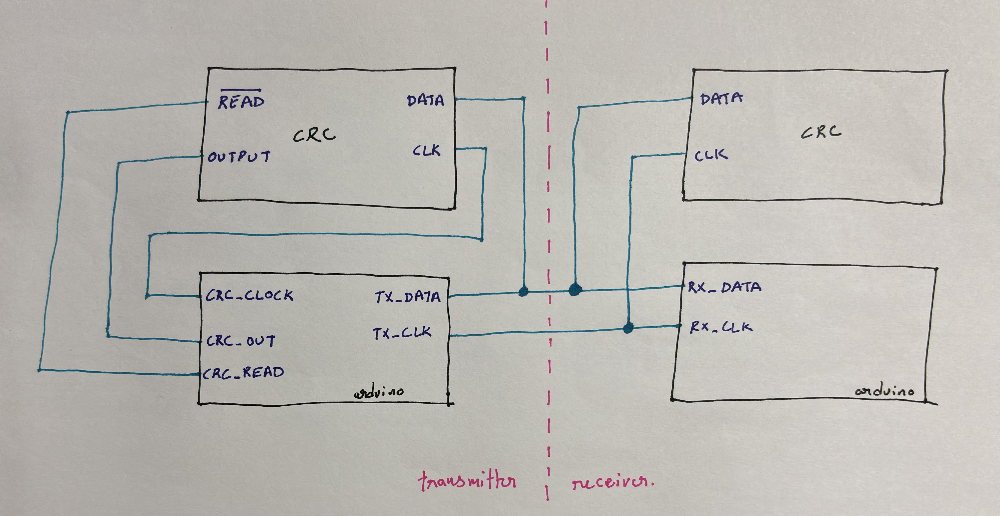

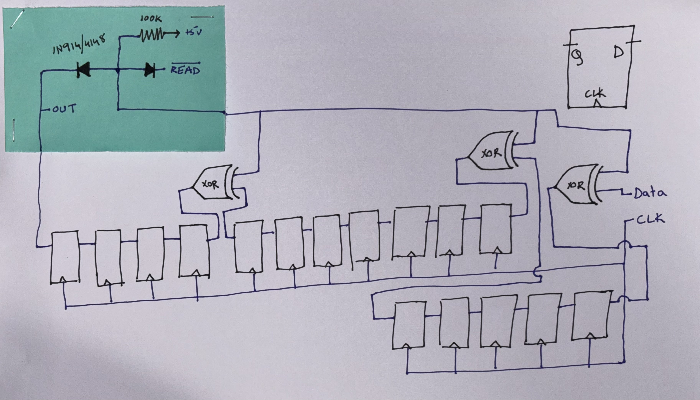


